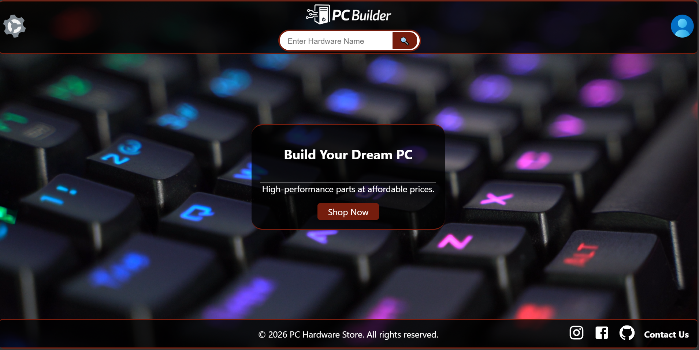
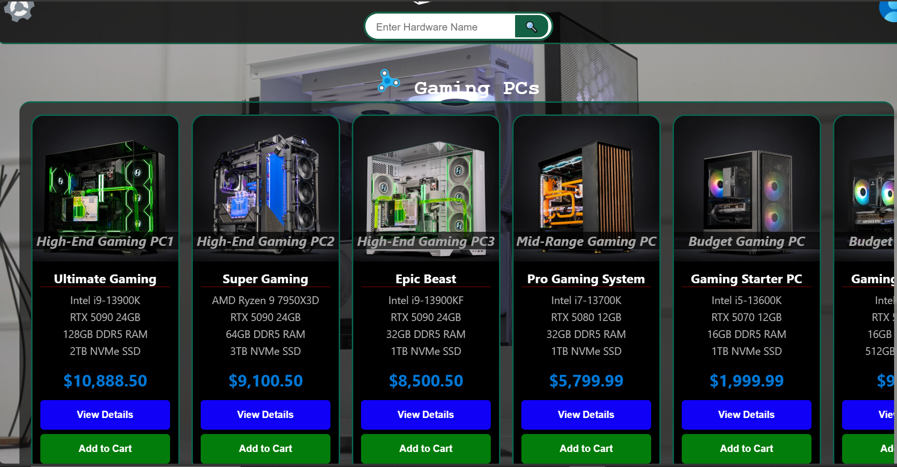
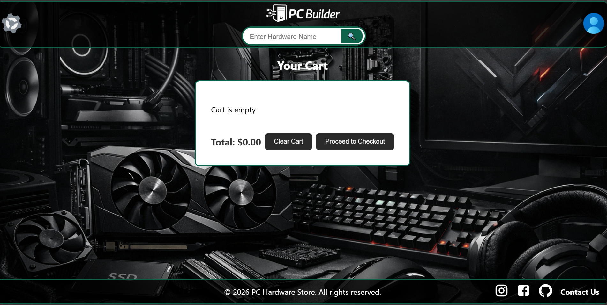

# PC Hardware Store

A React-based web application showcasing PC hardware products with cart functionality, product detail pages, and category browsing. Built with React Router, Context API, and deployed on GitHub Pages.

---

##  Live Demo
 [PC Hardware Store](https://abbassfreidy-byte.github.io/pc-hardware-store/)

---

## Features
-  Shopping cart with add/remove functionality  
-  Product detail pages with dynamic routing  
-  Category pages (Cases, CPUs, GPUs, RAM, Storage, PSUs, Cooling)  
-  User signup page  
-  About page with project info  
-  Responsive design with NavBar and Footer  

---

##  Setup Instructions

1. **Clone the repository**
   git clone https://github.com/AbbassFreidy-byte/pc-hardware-store.git
   cd pc-hardware-store

2. **Install dependencies**
   npm install

3. **Run locally**
   npm start

4. **Build for production**
   npm run build

5. **Deploy to GitHub Pages
   npm run deploy
📂 Project Structure
Code
src/
 ┣ components/
 ┃ ┣ NavBar/
 ┃ ┣ Footer/
 ┃ ┗ ProductCard.jsx
 ┣ context/
 ┃ ┗ CartContext.js
 ┣ pages/
 ┃ ┣ Home.jsx
 ┃ ┣ ProductsPage.jsx
 ┃ ┣ CartPage.jsx
 ┃ ┣ Case.jsx
 ┃ ┣ CPU.jsx
 ┃ ┣ Mobo.jsx
 ┃ ┣ GPU.jsx
 ┃ ┣ RAM.jsx
 ┃ ┣ Storage.jsx
 ┃ ┣ PSU.jsx
 ┃ ┣ Cooling.jsx
 ┃ ┣ SignUp.jsx
 ┃ ┣ About.jsx
 ┃ ┗ ProductURL.jsx
 ┗ App.js
 Screenshots

📦 Tech Stack
React (Create React App)
React Router v6
Context API (Cart management)
GitHub Pages (Deployment)

👨‍💻 Author
Developed by Abbass Bassel Freidi  
GitHub: AbbassFreidy-byte (github.com in Bing/chrome)